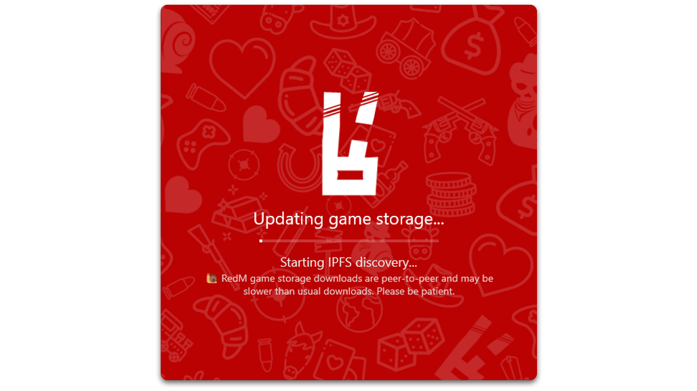

 

  

  <h3 align="center">help with peer-to-peer problems</h3>

  

    Here you will find the game-storage folder which will be constantly updated
     
    <a href="https://github.com/LittleShiiouDEV/help-redm-p2p/game-storage">download</a>
    ·
    <a href="#about-the-project">tutorial</a>
  

## TUTO

[![Product Name Screen Shot][product-screenshot]]()

Extract the folder and replace `game-storage` in `RedM Application Data > data` 

(<a href="#readme-top">back to top</a>)

## Contact

Little Shiiou - [Our discord](https://discord.gg/aVZb4emM69)

<a href="#readme-top">back to top</a>

[product-screenshot]: images/screenshot.gif
